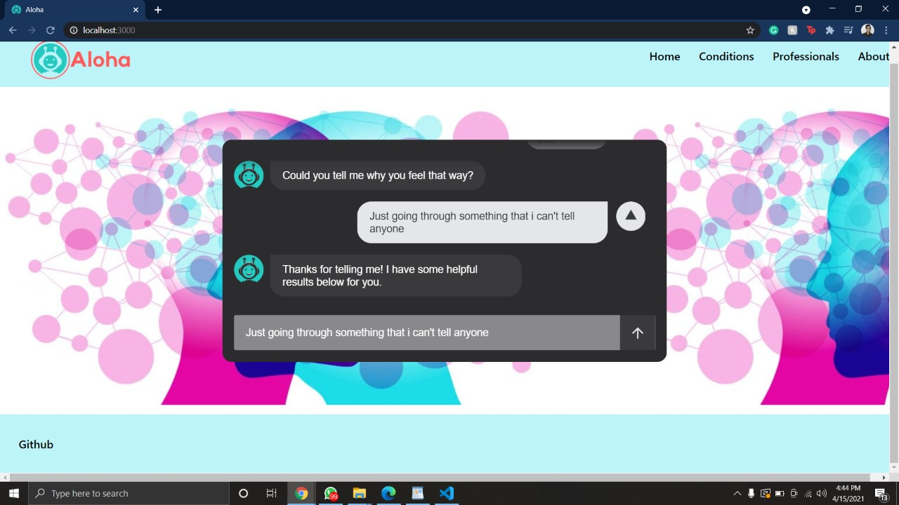

# Aloha

#Inspiration
Mental health is important, especially for the youth which goes through so many things everyday! We wanted to offer a friendly bot to help out!

#What it does

Aloha is a website with a chatbot geared towards helping people who are leading a stressful life. Its aim is to direct users to certain resources depending on user’s symptoms, a Community where users can read and post questions and blogs about their experience, and Professionals that provide answers to your questions and provide informative information.

#How we built it

We used Figma for our wireframe design, Javascript, CSS, and React.

#Challenges we ran into

Our biggest challenge was figuring out how to implement a chatbot with a dialogue tree. Originally, we wanted to train a machine learning AI to respond to text inputs, but later we decided to go with a more guided conversation flow. The dialogue tree chatbot took far longer than we expected it to, so we had to scale back the project's features to make the deadline.

# Accomplishments that we're proud of

We were able to implement a chatbot with a simple conversation flow thanks to Space10 Conversation Form and its React wrapper.

# What we learned

We learned about basic machine learning in Python and how it wasn't the right fit for our project, and we generally brushed up on React and design skills. Not all of us had used React before this project, so it was a good learning experience!

# What's next for Aloha

The chatbot function needs to be improved as well as finish the layout for webpage design. We hope we can expand this to help ease the stress of people from their life!
